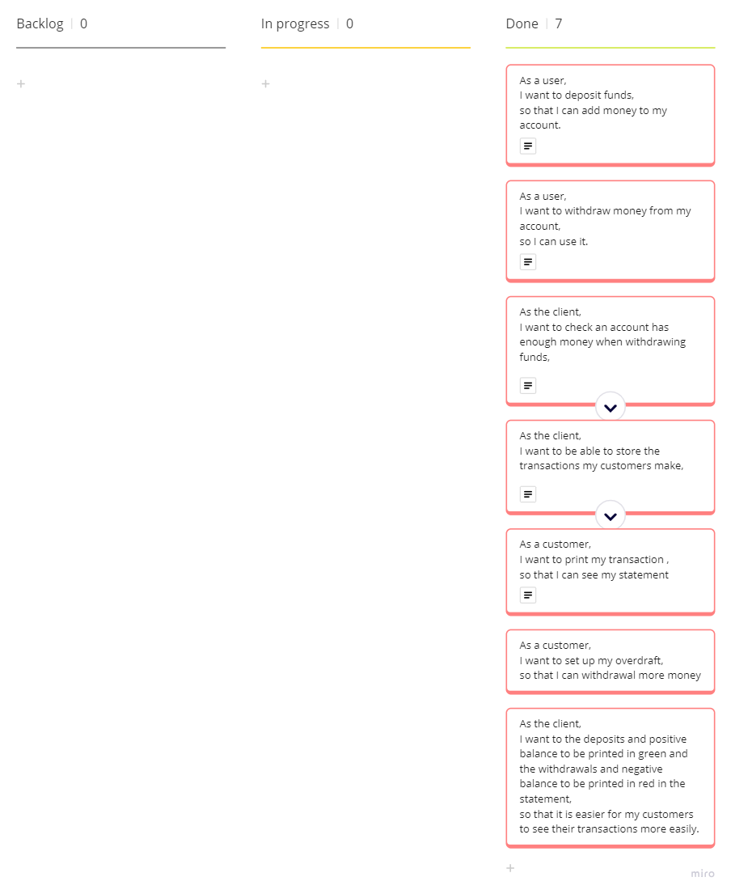

# Domain Models and Test Plan

## Core Requirements

## User Story 1

### Domain model for User Story 1
| Object  | Properties          | Messages | Output  |
| ------- | ------------------- | -------- | ------- |
| BankAccount | - balance @Float | - depositFunds(@Float, @String)         | - @Void |
|             | - transactions @Array[@String, @String, @Float, @Float] | - checkValidInput(@Float) | - @Boolean |
|       |       | - getBalance()   | -@Float|

### Test Plan for User Story 1
- **Test 1.1**: Deposit 100 and check it is stored in the account balance.
- **Test 1.2**: Deposit a negative number it should not change the balance.
- **Test 1.3**: Deposit multiple numbers and check the correct amount is stored.
- **Test 1.4**: Try deposit 0 to bank, should send an error asking for a valid input.
  
## User Story 2

### Domain model for User Story 2
| Object      | Properties                                              | Messages                        | Output     |
| ----------- | ------------------------------------------------------- | ------------------------------- | ---------- |
| BankAccount | - balance @Float                                        | - withdrawFunds(@Float, @String) | - @Void    |
|             | - transactions @Array[@String, @String, @Float, @Float] | - checkValidInput(@Float)       | - @Boolean |
|             |                                                         | - getBalance()                  | -@Float    |

### Test Plan for User Story 2
- **Test 2.1**: Have an account with some money and withdraw a small amount, check the amount withdrawn had been removed from the balance.
- **Test 2.2**: Give a negative withdrawal the account balance should stay the same.
- **Test 2.3**: Should allow multiple withdraws that are within than account balance and update the balance accordingly.
- **Test 2.4**: Try withdraw 0 from bank should send an error asking for a valid input.

## User Story 3

### Domain model for User Story 3
| Object  | Properties          | Messages | Output  |
| ------- | ------------------- | -------- | ------- |
| BankAccount | - balance @Float | - isWithdrawalValid(@Float) | - @Boolean |
| BankAccount | | - withdrawFunds(@Float, @String) | - @Boolean |

### Test Plan for User Story 3
- **Test 3.1**: Withdraw more money than currently in the account balance, the same balance.

## User Story 4

### Domain model for User Story 4
| Object      | Properties                                              | Messages                         | Output     |
| ----------- | ------------------------------------------------------- | -------------------------------- | ---------- |
| BankAccount | - balance @Float                                        | - addTransaction(@String, @String, @Float) | - @Void    |
|             | - transactions @Array[@String, @String, @Float, @Float] | - getTransaction()        | - @Array[@String, @String, @Float, @Float] |
|             |                                                         | - checkDateFormat()                   | -@Void    |

### Test Plan for User Story 4
- **Test 4.1**: Should increase transaction array size after a successful withdrawal.
- **Test 4.2**: Should add the correct transaction to array a successful withdrawal.
- **Test 4.3**: Should increase transaction array size after a successful deposit.
- **Test 4.4**: Should add the correct transaction to array a successful deposit.
- **Test 4.5**: Should not increase transaction array size when a invalid withdrawal is made.
- **Test 4.6**: Should not increase transaction array size when a invalid withdrawal is made.
- **Test 4.7**: Should not increase transaction array size when a invalid deposit is made.

## User Story 5

### Domain model for User Story 5
| Object      | Properties                                              | Messages                                   | Output                                     |
| ----------- | ------------------------------------------------------- | ------------------------------------------ | ------------------------------------------ |
| BankAccount | - balance @Float                                        | - printStatement(@Array[@String, @String, @Float, @Float]) | - @Void                    |
|             | - transactions @Array[@String, @String, @Float, @Float] | - checkTransactionType(@Array[@String, @String, @Float, @Float]) | -@Boolean |

### Test Plan for User Story 5
- **Test 5.1**: Should print just the header when print statement is used without any transactions.
- **Test 5.2**: Should make some a valid withdrawal then print the statement correctly.
- **Test 5.3**: Should make some a valid deposit, print the statement the check it is printed correctly.
- **Test 5.4**: Make some transaction and it should print the transaction in the correct format.

## Additional Features

## User Story 6
### Domain model for User Story 6
| Object      | Properties                                              | Messages                                                         | Output    |
| ----------- | ------------------------------------------------------- | ---------------------------------------------------------------- | --------- |
| BankAccount | - transactions @Array[@String, @String, @Float, @Float] | - setOverdraft(@Boolean)       |    |
|             | - balance @Float                                        | - setOverdraftLimit(@Boolean) |  |
|             | - overdraft @Boolean                                    |  |  |
|             | - overdraftLimit @Float                                 | |  |
### Test Plan for User Story 6
- **Test 6.1**: Should return true for overdraft status after over draft is set up.
- **Test 6.2**: Should set the overdraft limit to the agreed number.
- **Test 6.3**: Should increase transaction array with a withdrawal that goes into the overdraft.
- **Test 6.4**: Should change the balance to show the new negative value.
- **Test 6.5**: Should not change balance when trying to withdraw more money. than the overdraft is set to.
- **Test 6.6**: Should not add transaction to array if the withdrawal amount was more money than the overdraft is set to.

## User Story 7
### Domain model for User Story 7
| Object      | Properties                                              | Messages                                                         | Output    |
| ----------- | ------------------------------------------------------- | ---------------------------------------------------------------- | --------- |
| BankAccount | - transactions @Array[@String, @String, @Float, @Float] | - printStatement(@Array[@String, @String, @Float, @Float])       | - @Void   |
|             |                                                         | - checkTransactionType(@Array[@String, @String, @Float, @Float]) | -@Boolean |

### Test Plan for User Story 7
- **Test 7.1**: Should make a call to chalk.green when a deposit is made.
- **Test 7.2**: Should make a call to chalk.red when a deposit is made.

## Kanban Board With User Stories

